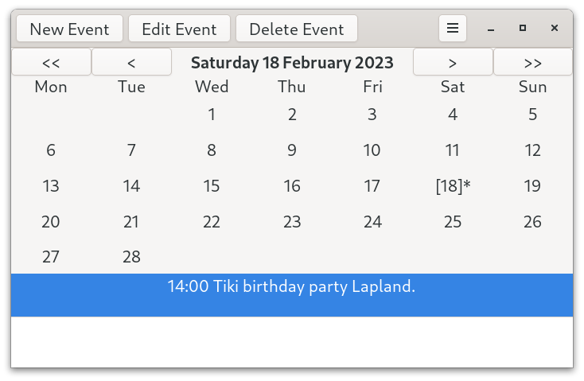

# Talk Calendar (gtk4)

Talk Calendar (Gtk4 version) is a personal desktop calendar with some speech capability developed using C and [Gtk4](https://docs.gtk.org/gtk4/) for Linux desktops like GNOME.

## Core Features

* built with Gtk4.6
* event summary, location, start and end time can be entered and edited
* bespoke month calendar which allows days with events to be marked
* priority and is yearly can be used
* csv file storage with memory dynamically allocated for up to 5000 records
* speech synthesizer
* binary for 64-bit Gtk4 distributions

The project has been renamed Tiki Calendar and the repository has been  moved to [here](https://github.com/crispinalan/tikicalendar).
